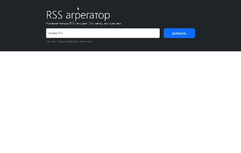

# RSS Agrigator

### Visit

[Website](https://frontend-project-11-dend3lion.vercel.app/)


# Group Chat App

[](https://github.com/Dend3lion/frontend-project-11/actions)
[](https://github.com/Dend3lion/frontend-project-11/actions/workflows/webpack.yml)
[](https://codeclimate.com/github/Dend3lion/frontend-project-11/maintainability)

This is a web app for RSS feed aggregation. It features adding and viewing feeds, visiting posts, localization, errors monitoring and more. It is a student project at Hexlet.

## Live Demo

A live demo of the app can be found at [Vercel](https://frontend-project-11-dend3lion.vercel.app/)

## Technologies Used

- MVC Architecture
- Axios
- Bootstrap
- Webpack
- i18next
- on-change
- Yup
- i8next

## Example

<p align="center">  
</a>
</p>

## Installation

To run this app locally, you will need to follow these steps:

1. Clone the repository
2. Run the following commands

```bash
make install
make start
```

## Usage

Once the app is running, you can create an account or log in if you already have one. You can then create channels or join existing ones to start chatting with other users. The app includes a profanity filter to prevent offensive language and has error monitoring to ensure smooth performance.

## Contributing

Contributions to this project are welcome. If you would like to contribute, please fork the repository and submit a pull request with your changes.

## License

[MIT](https://choosealicense.com/licenses/mit/)
